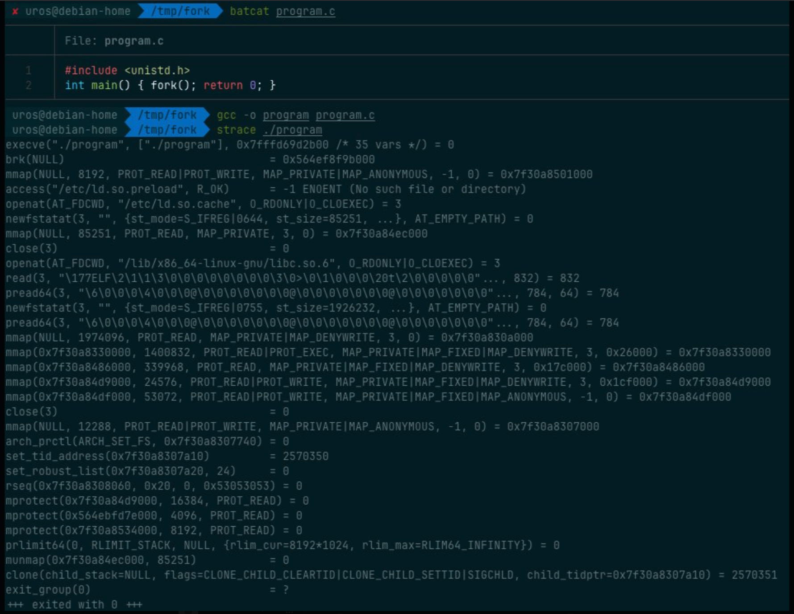

## fork - [Linux syscall #57](https://github.com/torvalds/linux/blob/master/arch/x86/entry/syscalls/syscall_64.tbl#L69)

Creating a process on Linux involves a trick.

You'd think fork() duplicates your entire process - heap, stack, etc. Naively, that's a full memory copy.

But actually copying gigabytes of RAM just to spawn a shell command? That would freeze your system.

So Linux optimizes!

It uses Copy-on-Write (COW).

The parent and child's page tables point to the \*exact same\* physical memory frames.

The moment either process tries to \*write\*, the kernel traps the page fault, copies just that single 4KB page, and resumes.

fork() is also a function that returns twice.

Once to the parent (returns child's PID), once to the child (returns 0).

This splits the universe, allowing one code block to handle two execution paths.

```c
#include <unistd.h>
#include <stdio.h>

int main() {
  pid_t pid = fork();

  if (pid == 0) {
    printf("I am the child!\n");
  } else {
    printf("I am the parent of %d\n", pid);
  }
  return 0;
}
```

Under the hood, however, glibc's fork() doesn't even call the `fork` syscall anymore!!

It calls `clone` - the swiss-army knife that also powers threads and other tasks.

The `fork` syscall still exists in the kernel, but glibc treats it as "clone configured for classic process duplication."

Check out this strace!<br>


---

## Reference

- [Uros Popovic: fork thread](https://x.com/popovicu94/status/2008768772384125098)
- [fork(2) — Linux manual page](https://man7.org/linux/man-pages/man2/fork.2.html)
