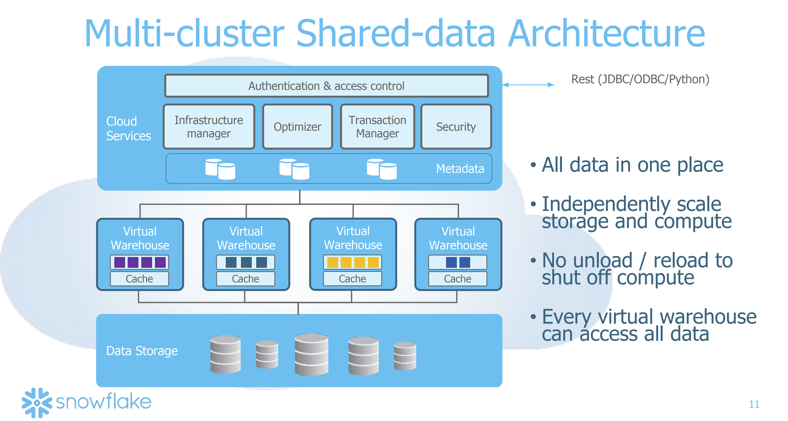

[CMU Advanced Database Systems - 25 Ashish Motivala [Snowflake] (Spring 2018)](https://www.youtube.com/watch?v=dABd7JQz0A8) 
CMU Database Group 
May 8, 2018

Presenters:
- Ashish Motivala, prior work on in-memory database @ Oracle
- Jiaqi Yan, prior work on query optimizer @ Oracle

[Snowflake](https://www.snowflake.com/en/) is
- an enterprise data warehouse product for Online Analytical Processing (OLAP)
- multi-tenant transactional database in the cloud

Founders:
- Benoît Dageville, data architect @ oracle
- Thierry Cruanes, data architect @ oracle
- Marcin Żukowski, co-founder of Vectorwise

Pre-cloud traditional data warehouse (DW) 
• were designed for small, fixed clusters 
• relied on complex ETL pipelines 
• typical usage pattern: nightly batch jobs 

Snowflake started around 2012 with vision: 
• cloud data warehouse as a service with SQL frontend and no infrastructure to manage 
• multi-dimensional elasticity 
• on demand scalability 
• support for all types of data 

Some observations about typical Shared-Nothing Architecture:
- horizontal partitioning of tables across the nodes
- every node has local storage
- every node is only responsible for its local table partitions

Some of the issues with Shared-Nothing Architecture: 
• couples compute and storage 
• resizing compute requires redistributing lots of data 
• cannot shutdown unused compute 
• failures, upgrades may cause downtime and results in performance penalty 

### Snowflake Architecture
- Multi-cluster, *Shared data* Architecture broadly split into 3 layers
  1. Cloud Services
  2. Virtual Warehouse(s)
  3. Data Storage

- Storage decoupled from compute
- Can handle any data (structured as well as semi-structured)
- Unlimited scalability
- Instant cloing
- Highly Available
  - Durability: 11 9's
  - Availability: 4 9's
- Low cost compute on demand

Snowflake 
• has a concept of a virtual data warehouse (DW). At a time, there can be multiple virtual DWs in action each working on its own data. 
• has connectors for other non-SQL solutions like Apache Spark 
• has dashboarding features like Tableau, Qlik 
• Data in S3 or block storage is immutable 
• Large metadata associated with data e.g. accounts, users, sessions, billing, SQL statement, transactional changes 
• The metadata storage is a separate system, available to all the services in the DW 
• Cloning: 
  - Each virtual DW gets its own copy of the subset of data that's needed. This offers really good cache locality. 

#### Cloud Services - manage "everything other than query execution"
• Authentication & Access Control 
• Infrastructure Manager 
• Optimizer 
• Transaction Manager 
• Security 
• Metadata 

a virtual DW
. completely stateless worker-set
. work on a plan
. fetch data from S3
. cache data locally
. poll for more work when done

[slide12] Data Storage Layer
. stores table data & query results
  immutable micro-partitions
  turned out to be a huge blessing

  <<S3 (object storage) was built for write-once-read-many (WORM) use-case>>
. micro-partitions
. S3 performance not that good; but addressed via local caching

[slide13] Table Files
. immutable 16 MB micro-partitions
. what a micro-partition looks like
. PAX format - hybrid columnar storage
. each column is stored separately within the same file
  compressed data within each column
  compression scheme depending on the data type
  numbers => base encoding
  strings => trie's & dictionary encoding
  JSON    => trie
. header maintains an offet for each column within the file
  fseek()

#### References:
1. [slides](https://15721.courses.cs.cmu.edu/spring2018/slides/25-snowflake.pdf)
