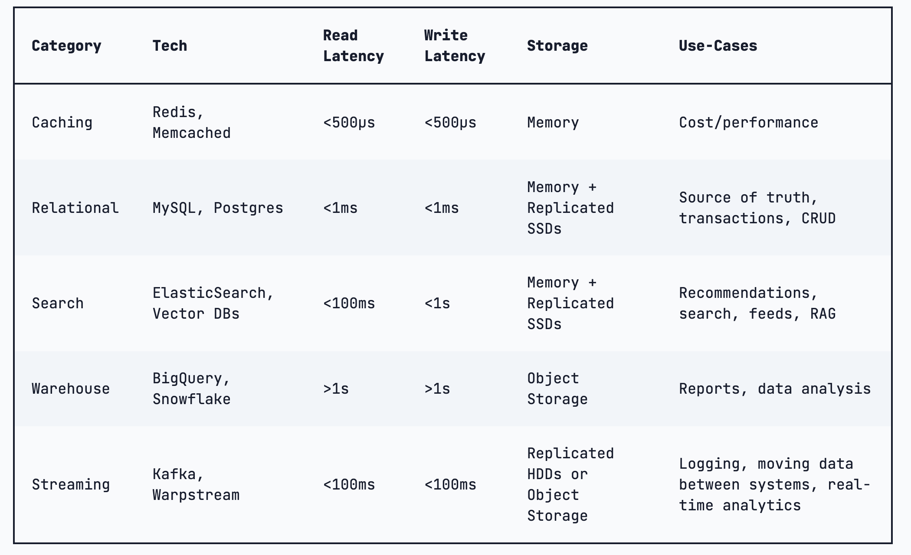

[turbopuffer: fast search on object storage](https://turbopuffer.com/blog/turbopuffer) 
July 08, 2024 • Simon Hørup Eskildsen (Co-founder & CEO)

#### 2022 cloud pricing

| Destination              | Price per GB |
|:-------------------------|:-------------|
| memory                   | $2+   |
| NVMe SSD                 | $0.60 |
| object storage (S3, GCP) | $0.02 |

**Latency for various components in the modern infra stack**

#### turbopuffer Features
- multi-tenancy
- sharding
- object storage first, storage engine 
  writes are durably committed to object storage
- any node can serve traffic for any namespace
- compute runs on spot nodes
